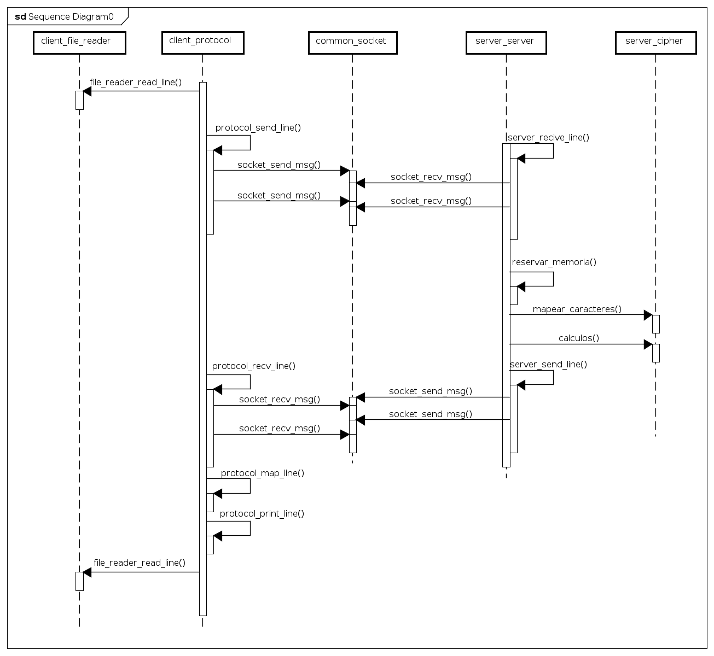

# Tp1 - Taller de programacion I

**Nombre:**  Santiago Pablo Fernandez Caruso

**Padron:** 105267

**Repositorio:** https://github.com/SaFernandezC/Tp1-Taller

## Descripcion

El presente trabajo consta de la implementacion de un programa cliente / servidor el cual debe sigue el protocolo descripto en el enunciado y su funcion es encriptar lineas de texto.  El objetivo del mismo es familiarizarse con el uso y manejo de sockets y plantear un modelo "orientado a objectos" haciendo uso de los tipos de datos abstractos TDA.

Para la implementacion se utilizaron diferentes TDA de forma de encapsular y modularizar de forma correcta. Por el lado del servidor se utiliza el  tda socket, tda server y tda cipher. En cuanto al cliente, se utiliza el tda protocol, el tda file_reader y tambien el tda socket utilizado en el servidor.

## Detalles Implementacion

Para la implementacion del cifrado se opto por utilizar una matriz estatica de 4x4 para cualquiera de los largos de la clave. Para que esto no genere problemas se calcula el tamaño que deberia tener la matriz en base a la clave ingresada por el usuario y solo se cargan las posiciones necesarias dejando con "basura" las que no se necesitan, sabiendo que nunca van a ser accedidas.

Otro detalle a tener en cuenta es que antes de llegar al paso del cifrado hay que verificar que el largo del mensaje a cifrar sea multiplo del tamaño de la matriz de la clave, para esto el cipher tiene la funcion adjust_len la cual se encarga de calcular la nueva longitud y de achicar/agrandar el vector para cumplir la condicion, si se da el caso de agrandar el vector del mensaje la funcion coloca ceros en las nuevas posiciones para cumplir con las condiciones del cifrado.

La funcion principal del TDA es cipher_cifrar_msg que es la encargada de realizar la multiplicacion de la matriz de la clave por cada subvector y dejar los nuevos valores del mensaje cifrado.

El tda socket es el encargado de realizar la conexion con el servidor (cuando se lo usa del lado del usuario), y de aceptar conexiones (cuando se lo usa del lado del server) y tambien de enviar y recibir los mensajes (bytes) en ambos casos.

## Diagramas

A continuacion, un diagrama de 1 iteracion (tanto lo que se ejecuta del lado del cliente como lo del servidor va en un loop) de la secuencia de envio y recibo de mensajes. Es un diagrama simplificado (no se incluyen los parametros ni los retornos en las funciones, y se utiliza la misma representacion para los sockets aunque no son los mismos) para no entorpecer la lectura del mismo.

